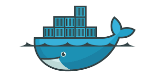
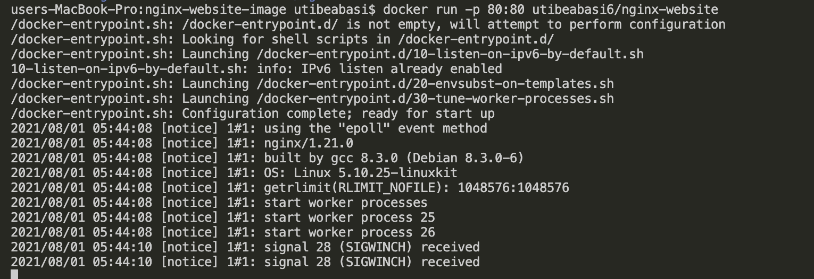
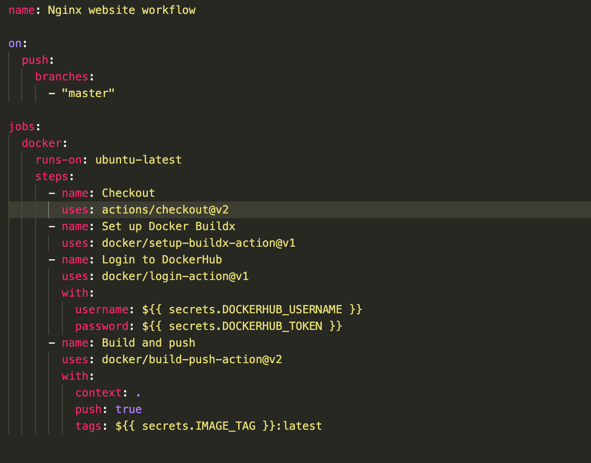

# CI/CD pipeline with github actions

     

This project aims to demonstrate how to build a Continous integration pipeline to automatically build and push a docker image to docker hub whenever a push is made to the repository.
> Note: this assumes you have a working knowlege of git, docker and github actions

## Installation guide
### **Install git**
[https://git-scm.com/downloads](https://git-scm.com/downloads)

### **Install docker**
[https://docs.docker.com/get-docker/](https://docs.docker.com/get-docker/)

## Setup
1. Clone the project repository by running:
    ```
    git clone <REPO_URL> 
    ```
    

2. Navigate to the nginx-website folder by running:
    ```
        cd nginx-website-docker
    ```

3. Build the docker image by running:
    ```
        docker build -t <your_username>/nginx-website:latest .
    ```
    

    > Note: this assumes the Dockerfile is in the directory you are running this command

4. Run the newly built image to check out the website in a browser
    ```
        docker run -p 80:80 <your_username>/nginx-website
    ```
    

    This creates a new container from the image and binds port 80 of the container to port 80 of the host machine

5. Visit `http://localhost` to view the website

    

    Click `ctrl+c` to stop the running container
    > Note: I did not make this website but got it as a template on bootstrapmade.com

## Github actions
### What is github actions? 
GitHub Actions makes it easy to automate all your software workflows, now with world-class CI/CD. Build, test, and deploy your code right from GitHub. Make code reviews, branch management, and issue triaging work the way you want.

### Getting started with github actions

[https://docs.github.com/actions](https://docs.github.com/actions)

## A look at our pipeline
We just have a basic pipeline with one job named docker



The pipeline has been configured to run everytime a push is made to the master branch

### Steps
- Checkout: The `checkout` action is used to checkout the source code

- Setup docker buildx: The `setup-buildx-action` is used to set up docker buildx on the runner

- Dockerhub login: The dockerhub username and password are gotten from the repository secrets and used to login to dockerhub

- Build and push: Finally, the `build-push-action` builds the image from the Dockerfile and pushes it to docker hub


The pipeline lives in a file called `nginx-website-docker` which, according to github actions specifications, lives in the `.github/workflows` folder.

### Running the pipeline
The pipeline runs automatically whenever a push is made to the master branch
